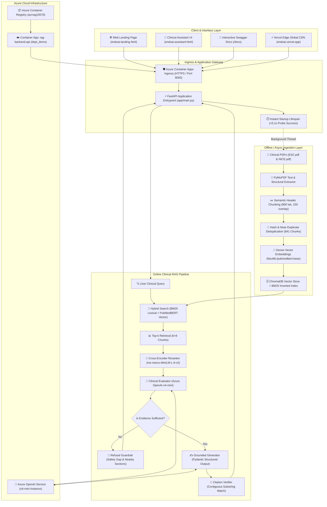
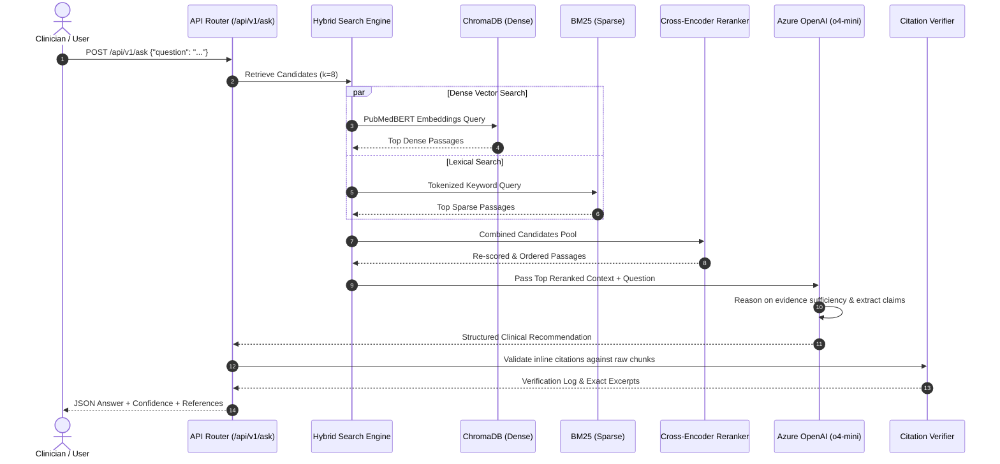
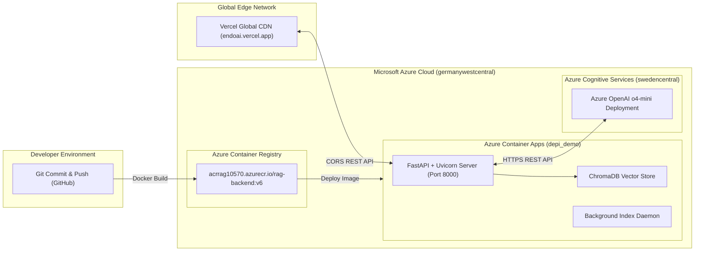

# 🫀 EndoAI: Clinical RAG Architecture & Technical Specification

> **A Clinically Grounded Medical Question-Answering System for Infective Endocarditis Guidelines (ESC 2023 & NICE CG64)**  
> *Powered by Hybrid Retrieval (PubMedBERT + BM25), Cross-Encoder Reranking, Azure OpenAI `o4-mini`, and Zero-Hallucination Citation Verification.*

---

## 1. High-Level System Architecture



---

## 2. Core Architectural Pillars

### A. Ingestion & Document Preprocessing
1. **Multi-Guideline Ingestion**:
   - Extracts structured textual content and clinical hierarchies from `ESC.pdf` (European Society of Cardiology 2023 Guidelines, 98 pages) and `NICE.pdf` (National Institute for Health and Care Excellence CG64).
2. **Header-Aware Chunking & Deduplication**:
   - Uses PyMuPDF with font-size heuristic detection to identify clinical section headers (e.g., *Diagnostic Criteria*, *Prophylaxis*, *Urgent Surgery*).
   - Generates chunks of 900 characters with 150-character overlap.
   - Applies MD5 exact deduplication and normalized n-gram near-duplicate removal, resulting in **841 clean guideline passages**.
3. **Dual-Index Creation**:
   - **Dense Index**: Embedded via `NeuML/pubmedbert-base-embeddings` and persisted in **ChromaDB**.
   - **Sparse Index**: Indexed via **BM25Okapi** with tuned parameters ($k_1=1.5, b=0.75$) to capture exact medical terminology, acronyms (IE, PVE, NVE, TEE, TTE), and drug dosages.

---

### B. Hybrid Retrieval & Cross-Encoder Reranking


---

### C. Clinical Reasoning & Safety Guardrail Layer
* **Model**: Azure OpenAI `o4-mini` via Structured Outputs (`client.beta.chat.completions.parse`).
* **Strict Evaluation Protocol**:
  1. The model evaluates whether the retrieved chunks provide explicit, conclusive evidence.
  2. If evidence is ambiguous or missing (e.g., asking for an undocumented medication dose), the system triggers the **Refusal Guardrail**:
     - `refused: true`
     - Returns `evidence_gap` specifying exactly what information is missing.
     - Returns `evidence_found_nearby` suggesting related sections found in the guidelines.
* **Grounded Generation**:
  - Structured output schemas guarantee that every clinical claim has an associated document name, section, and page number.

---

### D. Citation Verifier (Zero Hallucination Guarantee)
* Every citation returned by the generator is checked against the raw chunk text using **Longest Contiguous Substring Matching (LCS)**.
* Matches with a similarity ratio $\ge 0.70$ are verified and linked to page numbers.
* Discrepancies are flagged in the `verification_log`, ensuring zero ungrounded statements reach the clinician.

---

## 3. Infrastructure & Deployment Architecture



---

## 4. API Endpoints Reference

| HTTP Method | Endpoint | Description |
| :--- | :--- | :--- |
| `GET` | `/` | Serves the interactive Web Landing Page |
| `GET` | `/assistant` | Serves the Clinical AI Assistant chat interface |
| `GET` | `/api/v1/health` | Health probe reporting server status, index readiness, and chunk count |
| `POST` | `/api/v1/ask` | Clinical RAG QA pipeline with hybrid retrieval & structured response |
| `GET` | `/api/v1/documents` | Lists all indexed medical guideline PDF documents |
| `GET` | `/api/v1/documents/{filename}` | Streams raw guideline PDF for in-browser inspection |
| `GET` | `/api/v1/collections/stats` | Vector store metrics, embedding model, and persist directory stats |
| `POST` | `/api/v1/reindex` | Triggers background index re-extraction and embedding |
| `GET` | `/docs` | Interactive OpenAPI 3.1 Swagger UI documentation |

---

## 5. Non-Blocking Startup Mechanism

To prevent Cloud Gateway timeouts (e.g., Azure 504 Ingress Timeout), the server separates networking from model loading:

```python
@asynccontextmanager
async def lifespan(app: FastAPI):
    # 1. Server listens on HTTP port immediately in <0.1s
    # 2. Azure health probes succeed on first attempt
    t = threading.Thread(target=_build_rag_background, args=(app,), daemon=True)
    t.start()
    yield
```

* While the index builds in the background thread, `/api/v1/health` returns `index_ready: false`.
* Once completed, `/api/v1/health` flips to `index_ready: true (841 chunks)`, enabling full query processing.

---

## 6. Technology Stack Summary

| Layer | Technology |
| :--- | :--- |
| **Language & Framework** | Python 3.11, FastAPI, Uvicorn, Pydantic v2 |
| **PDF Extraction** | PyMuPDF (fitz) |
| **Embeddings** | `NeuML/pubmedbert-base-embeddings` (HuggingFace Transformers / PyTorch) |
| **Vector Database** | ChromaDB (Persistent Disk Storage) |
| **Lexical Search** | Rank-BM25 (BM25Okapi) |
| **Reranking** | `cross-encoder/ms-marco-MiniLM-L-6-v2` |
| **LLM Reasoning** | Azure OpenAI `o4-mini` (Structured Outputs & Function Calling) |
| **Containerization** | Multi-stage Docker (Python 3.11 Slim + libgomp1) |
| **Cloud Hosting** | Azure Container Apps, Azure Container Registry, Azure OpenAI |
| **Frontend UI** | HTML5, Vanilla CSS3 (Custom Design System, Glassmorphism, Responsive Drawer), JavaScript ES6 |
| **Edge Distribution** | Vercel Global Edge Network |
